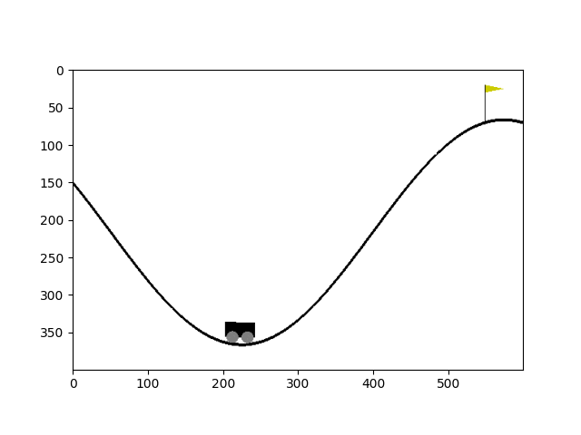
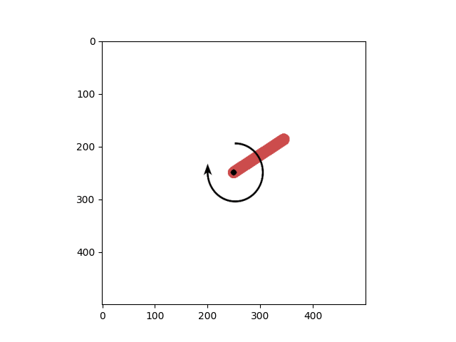
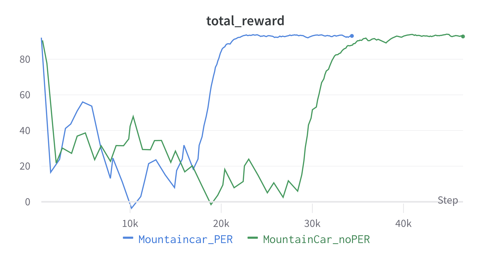
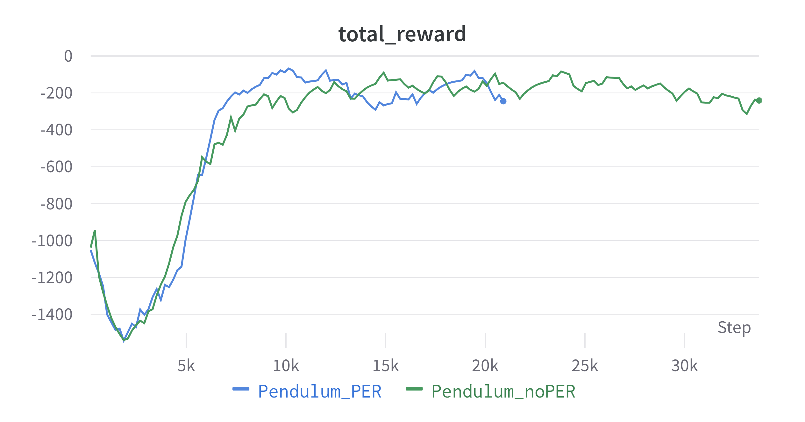

# Deep Deterministic Policy Gradient (DDPG) with Prioritized Experience Replay

**Authors**: [Luca Iezzi](https://github.com/korovev) and [Giulia Ciabatti](https://github.com/Giulia1809).

This consists of a complete reimplementation of [DDPG with PrioritizedExperience Replay](https://arxiv.org/abs/1511.05952), and its adaptation on Pendulum-v1 and MountainCarContinuous-v0, from [OpenAI Gym](https://www.gymlibrary.dev/).

|    **Agent playing**   |
|:-----------------------:|
|            |
|                    |

## Usage
This implementation is based on Python 3.8 and PyTorch Lightning. To install all the requirements:

```bash
$ pip install -r requirements.txt
```

## 


## Hyperparameters
<table>
<tr><th>PER_BUFFER</th><th>ACTOR </th><th>CRITIC</th></tr>
<tr><td>

|    **hyperparameter**          |     **value**     |
|:------------------------------:|:-----------------:|
| WARM_POPULATE                  | 10000             |
| ALPHA                          | 0.6               |
| BETA                           | 0.1               |
| PRIORITIZED_REPLAY_ALPHA size  | 0.6               |
| PRIORITIZED_REPLAY_BETA0 size  | 0.4               |
| PRIORITIZED_REPLAY_BETA_ITERS  | None              |
| PRIORITIZED_REPLAY_EPS rate    | 1e-6              |
| BATCH_SIZE                     | 64                |
| Latent size                    | 64                |
| EPISODES                       | 150               |

</td><td>

|    **hyperparameter**   |     **value**     |
|:-----------------------:|:-----------------:|
| OU_NOISE_STD            | 0.8               |
| OPTIMIZER               | Adam              |
| LEARNING RATE           | 1e-4              |
| GAMMA                   | 0.99              |
| TAU                     | 5e-3              |

</td><td>

|    **hyperparameter**   |     **value**     |
|:-----------------------:|:-----------------:|
| OPTIMIZER               | Adam              |
| LEARNING RATE           | 5e-4              |
| GAMMA                   | 0.99              |
| TAU                     | 5e-3              |

</td>


</tr> </table>

## Results



##

## Running
The complete pipeline to train the 3 model components:

### 1. Train the agent
In ```simple_config.py```, set ```ENV=[gym env you want to train on]```, set ```TRAIN=True``` and run:
```bash
$ python main.py
```
### 1. Test the agent
In ```main.py```, manually copy the path of one of the checkpoints in ```ckpt/``` in the variable ```model```, set ```TRAIN=False``` and ```RENDER=True``` in ```simple_config.py``` and run:
```bash
$ python main.py
```

## Credits
Some of the implementations (e.g. SumTree and MinTree) have been taken by existing repos, but it's been impossible to track the original author :( . If you recognize your code there, don't hesitate to drop me an email and I will add your repo to the credits! 
